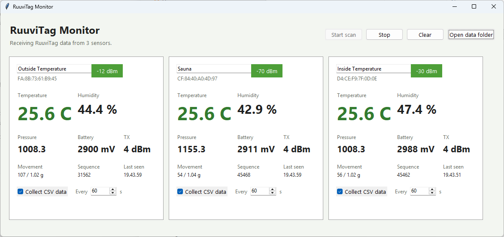

# RuuviTag Monitor

Python/Tkinter MS Windows desktop app for discovering nearby RuuviTag BLE advertisements and showing live sensor values.



## Hardware Requirements

- Windows PC with a Bluetooth adapter that supports Bluetooth Low Energy (BLE).
- BLE advertisement scanning support is required; pairing the RuuviTags is not needed.
- RuuviTags must be awake, broadcasting, and within Bluetooth range of the PC.
- Use the vendor Bluetooth driver when possible. On the development PC, the Realtek Bluetooth driver was required for reliable RuuviTag packet reception.
- If scans show no tags, check Windows Bluetooth is enabled, the Bluetooth Support Service is running, and no driver/device error is shown in Device Manager.

## Run

```powershell
cd C:\Coding\RuuviTagMonitor
.\.venv\Scripts\pythonw.exe main.py
```

If the virtual environment does not exist yet:

```powershell
python -m venv .venv
.\.venv\Scripts\python.exe -m pip install -r requirements.txt
.\.venv\Scripts\pythonw.exe main.py
```

## Features

- Start/stop BLE scanning.
- Decode Ruuvi RAWv2 manufacturer packets.
- Show temperature, humidity, pressure, battery, TX power, movement, sequence, RSSI, and last-seen time.
- Rename tags inline.
- Remember tag names by MAC address in `%LOCALAPPDATA%\RuuviTagMonitor\tag-names.json`.
- Auto-resize the window around the detected tag count.
- Enable CSV data collection separately for each discovered tag.
- Set each tag's capture interval from 1 to 86,400 seconds; collection settings persist between runs.
- Name each CSV from the user-defined tag name and capture-start date, such as `Kitchen_2026-07-10.csv`.
- Store the CSV files under `%LOCALAPPDATA%\RuuviTagMonitor\data`.

## CSV Data Collection

1. Give the discovered tag a descriptive name, then press `Enter` or move focus away from the name field.
2. Set the capture interval in seconds on that tag's card.
3. Select **Collect CSV data**. The current reading is recorded immediately, followed by one row per interval while advertisements are received.
4. Use **Open data folder** to view the collected files.

Each collection session keeps the tag name it had when capture began. The filename combines that name with the start date, for example `Sauna_2026-07-10.csv`. Starting another same-name session on the same date adds a numeric suffix, such as `Sauna_2026-07-10_2.csv`.

Each row contains the timestamp, MAC address, tag name, temperature, humidity, pressure, acceleration, battery voltage, TX power, movement counter, measurement sequence, and RSSI. Collection choices and intervals are restored when the application starts again.

## Shortcuts

- `F5`: start scanning.
- `Esc`: stop scanning.

## Build EXE

```powershell
.\build_exe.ps1
```
